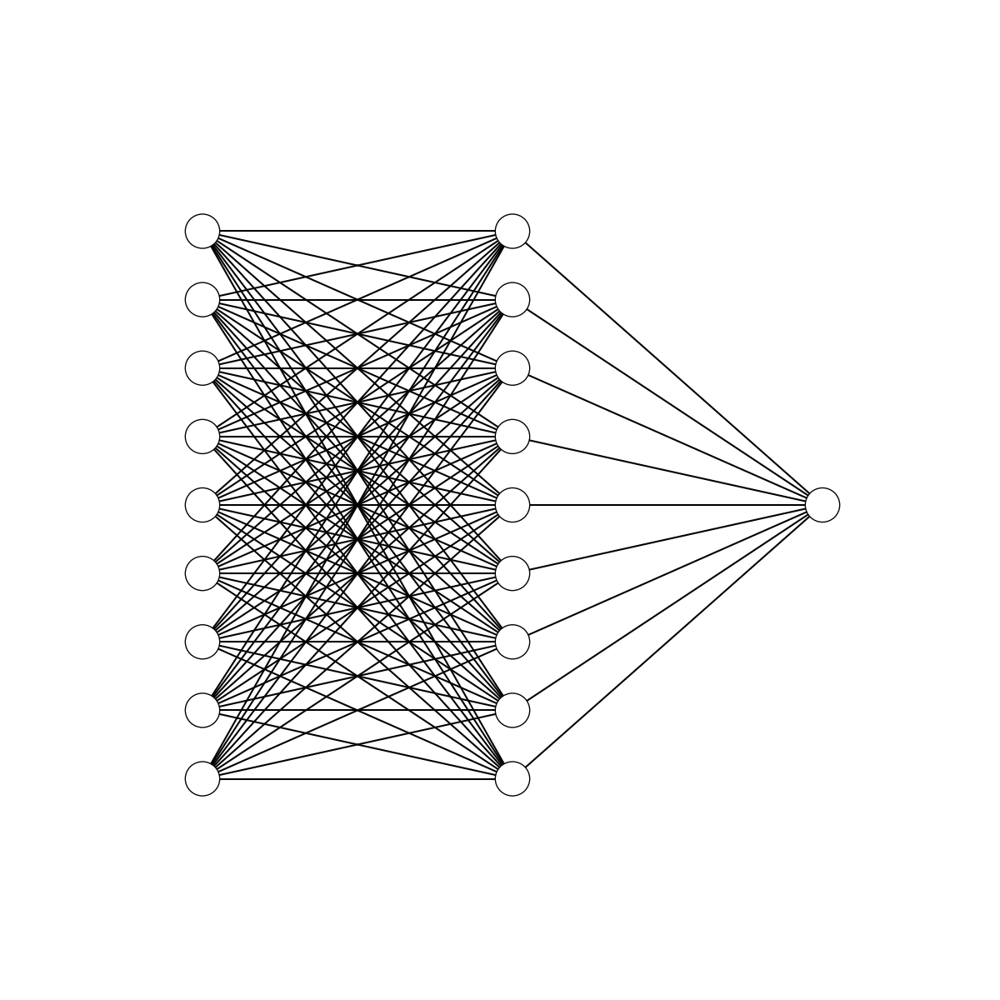

# TicTacToeWinnerSearcher
Neural network who search for a winner 

## What ?
This is a neural network with 9 inputs, a hidden layer of 9 neurons and 1 neuron for the output. It's only taking 0 and 1 in input.The output is always beetween 0 and 1.

This is my first neural network from scratch.

This is what my neural network looks like:

